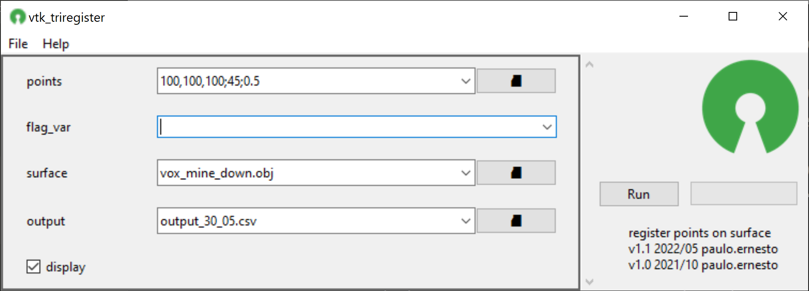
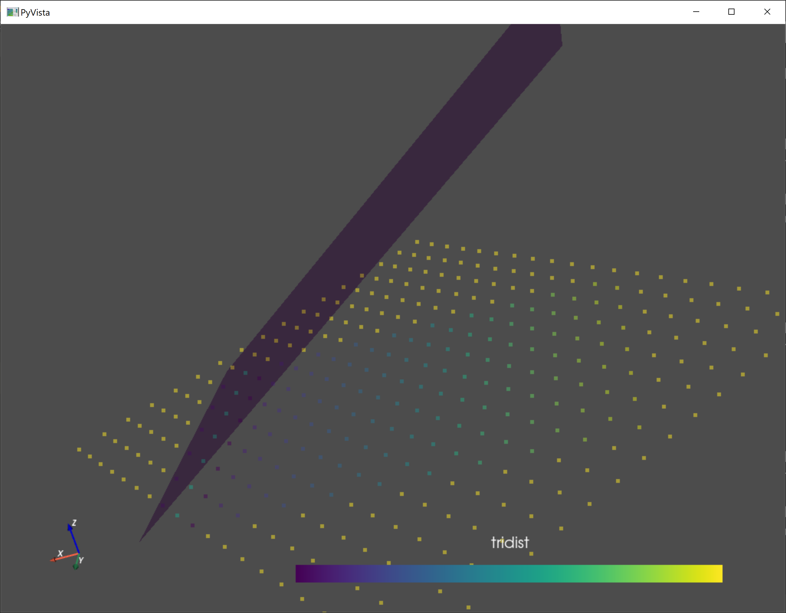
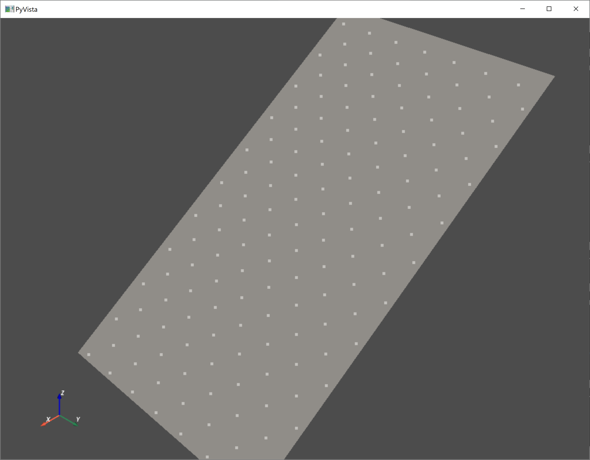

## 📌 Description
register points on surface, setting the point Z
## 📸 Screenshot

## 📝 Parameters
Name|optional|description
---|---|------
points|❎|either a point cloud in a supporte format or a schema definition
flag_var|☑️|variable to flag the Z. if blank each point Z coordinate will be flagged.
surface|❎|path to file in a supported format with surface to calculate distance to.
output|☑️|path to save the flagged point cloud
display||show result in a 3d window
## 📓 Notes
### Schema format
Instead of a point clould, a schema may be defined using the following syntax:
`xlength,ylength,zlength<;rotation in degrees><;offset<,offsety,offsetz>>`  
 - xlength,ylength,zlength define the distance between point cloulds  
 - rotation will cause the entire grid to be rotate by its center
 - offset will translate each point using the length as unit. can be a single value that will be applied to x,y,z or separated for each axis.
## 📚 Examples
### flag var

### flag Z

## 💎 License
Apache 2.0
